# SemanticContext

SemanticContext is a local-first semantic context engine for C# and .NET codebases. It indexes a solution with Roslyn, stores semantic chunks in Qdrant, and exposes query and indexing operations through an ASP.NET Core API that shares the same application services as the future MCP adapter.

## What It Does

- Indexes a `.sln` file and walks C# projects/documents with Roslyn
- Extracts semantic units such as classes, interfaces, records, methods, constructors, properties, and controller actions
- Generates deterministic summaries and chunk text
- Creates embeddings with a replaceable provider abstraction
- Stores vectors and metadata in Qdrant
- Serves indexing and semantic query endpoints over HTTP
- Keeps the core transport-agnostic so MCP can be added without duplicating business logic

## Architecture Overview

- `SemanticContext.Contracts` defines shared DTOs, enums, models, and interfaces
- `SemanticContext.Application` coordinates use cases and stays transport-agnostic
- `SemanticContext.Indexer` performs Roslyn-based solution scanning and chunk creation
- `SemanticContext.Retrieval` performs vector search, filtering, keyword boosts, and reranking
- `SemanticContext.Infrastructure` contains Qdrant, embeddings, hashing, and other adapters
- `SemanticContext.Api` is the HTTP adapter
- `SemanticContext.Mcp` is the future MCP adapter boundary
- `SemanticContext.Tests` covers Roslyn extraction, retrieval, reranking, adapter delegation, and a small end-to-end path

```mermaid
flowchart LR
  subgraph Adapters["Transport Adapters"]
    HTTP["ASP.NET Core Web API\n/index, /query, /health"]
    MCP["Future MCP Adapter\nsemantic_search, index_solution, get_symbol_context"]
  end

  subgraph Application["Application Core"]
    APP["ICodeContextApplicationService\norchestrates indexing and retrieval"]
    IDX["ICodeIndexer\nindex use case"]
    RET["ICodeContextRetriever\nquery use case"]
  end

  subgraph Indexing["Indexing Pipeline"]
    SLN["MSBuildWorkspace opens .sln"]
    PROJ["Project / document enumeration"]
    ROSLYN["Syntax tree + semantic model"]
    CHUNKS["Semantic chunk extraction\nclass, interface, record, method,\nconstructor, property, controller action"]
    SUM["Deterministic summary generation"]
    HASH["Content hash + manifest"]
    EMB["Embedding provider interface"]
    VSTORE["IVectorStore upsert"]
  end

  subgraph Retrieval["Retrieval Pipeline"]
    FILTER["Filter narrowing\nrepo, project, file, symbol kind, attributes"]
    VSEARCH["Vector search"]
    BOOST["Keyword boost + deterministic rerank"]
    RESP["Stable CodeContextResponse"]
  end

  subgraph Infra["Infrastructure Adapters"]
    QDRANT["Qdrant vector store adapter"]
    LOCAL_EMB["Deterministic local embedding provider"]
    HASHER["SHA-256 content hasher"]
  end

  HTTP --> APP
  MCP --> APP
  APP --> IDX
  APP --> RET

  IDX --> SLN --> PROJ --> ROSLYN --> CHUNKS --> SUM --> HASH --> EMB --> VSTORE --> QDRANT
  RET --> FILTER --> VSEARCH --> BOOST --> RESP

  LOCAL_EMB --> EMB
  HASHER --> HASH
  QDRANT --> VSEARCH
```



## Why The Core Is Transport-Agnostic

The application service is the single entry point for indexing and querying. HTTP and MCP are both thin adapters over that same service, so the core logic does not know or care how requests arrive. That makes it easier to reuse the same engine for local apps, an MCP server, CLI tools, or future automation.

## Progress

- [x] Solution scaffolded with separate contracts, application, indexer, retrieval, infrastructure, API, MCP, and test projects
- [x] Roslyn-based semantic extraction and deterministic chunk generation
- [x] Qdrant-backed vector storage adapter
- [x] HTTP API with `/index`, `/query`, `/health`, and OpenAPI metadata
- [x] Tests for extraction, retrieval, reranking, adapter delegation, and ChangedOnly cleanup
- [x] HTTP integration tests for validation and query delegation
- [x] Qdrant live integration test and adapter ID mapping
- [x] Draft PR published to GitHub
- [x] Add a real embedding provider adapter for local or remote models
- [x] Add richer controller-action metadata and symbol context shapes
- [x] Add repository and project metadata resources for MCP
- [x] Add stronger API validation and problem-details shaping
- [x] Add richer response summaries for semantic search
- [ ] Wire a real MCP SDK adapter
- [x] Add richer index manifests for cross-run pruning and reconciliation

## Project Structure

```text
SemanticContext.sln
src/
  SemanticContext.Contracts/
  SemanticContext.Application/
  SemanticContext.Indexer/
  SemanticContext.Retrieval/
  SemanticContext.Infrastructure/
  SemanticContext.Api/
  SemanticContext.Mcp/
tests/
  SemanticContext.Tests/
```

## Setup

1. Install the .NET 9 SDK.
2. Start Qdrant with Docker Compose.
3. Run the API.
4. Point the API at a solution path on disk and call `/index`.
5. Query the indexed repo with `/query`.

## Run Qdrant Locally

```bash
docker compose up -d
```

Qdrant will be available at `http://localhost:6333`.

Optional integration testing:

- Set `SEMANTICCONTEXT_QDRANT_URL` to point at a reachable Qdrant instance.
- Run the Qdrant integration test project filter when you want to exercise the live storage adapter.

## Configure The API

The API project ships with development-friendly defaults in `src/SemanticContext.Api/appsettings.json`.

Important settings:

- `Qdrant:Url`
- `Qdrant:CollectionName`
- `Qdrant:VectorSize`
- `EmbeddingProvider:Kind`
- `EmbeddingProvider:EndpointUrl`
- `EmbeddingProvider:Model`
- `EmbeddingProvider:ApiKey`
- `EmbeddingProvider:TimeoutSeconds`
- `EmbeddingProvider:Dimension`
- `Indexing:SnippetLength`
- `Indexing:CacheDirectory`
- `Retrieval:RerankWindowSize`

An example root configuration file is included as `appsettings.json.example`.

## Call `/index`

```bash
curl -X POST http://localhost:5000/index \
  -H "Content-Type: application/json" \
  -d '{
    "solutionPath": "/repos/MyApi/MyApi.sln",
    "repoName": "MyApi",
    "commitSha": "abc123",
    "reindexMode": "ChangedOnly"
  }'
```

## Call `/query`

```bash
curl -X POST http://localhost:5000/query \
  -H "Content-Type: application/json" \
  -d '{
    "query": "Where is order validation handled before checkout?",
    "repoName": "MyApi",
    "topK": 8,
    "filters": {
      "symbolKinds": ["Method", "NamedType"],
      "projectNames": ["Checkout.Api", "Checkout.Core"]
    }
  }'
```

## MCP Plan

`SemanticContext.Mcp` is intentionally thin and currently exposes a facade that maps MCP-shaped requests to the same application service used by HTTP.

Planned tools:

- `semantic_search`
- `index_solution`
- `get_symbol_context`

Planned resources:

- repository metadata
- project summaries
- symbol-level code context

## Implemented vs Not Implemented

Implemented:

- Roslyn solution loading and semantic extraction
- Deterministic chunk formatting and summary generation
- Qdrant-backed vector storage adapter
- Deterministic local embedding provider
- Remote HTTP embedding provider adapter
- HTTP API with `/index`, `/query`, `/health`, and basic OpenAPI exposure
- API request validation with problem-details responses
- MCP adapter skeleton
- Manifest-backed repository and project metadata resource shapes for MCP
- Atomic manifest persistence with cross-run pruning and reconciliation
- Deterministic UUID-safe Qdrant point IDs with original ID preservation in payloads
- Richer deterministic summaries for methods and controller actions
- Tests for extraction, filtering, reranking, delegation, and a small happy path
- HTTP integration tests for validation and query delegation
- Qdrant live integration test and adapter ID mapping

Not implemented yet:

- Real MCP protocol server wiring
- Advanced ranking and BM25-style keyword search
- Incremental file watch/index daemon
- GitHub/PR integration
- UI

## Recommended Next Improvements

1. Expand controller-action metadata extraction.
2. Add MCP SDK wiring around the existing facade.
3. Add a file watcher for continuous indexing.
4. Add more fixture solutions and negative tests.
5. Add auth and tenancy controls for multi-user deployments.
6. Add manifest diffing for repository-level change summaries.
7. Add real MCP tool/resource registration once the SDK layer is chosen.
8. Add integration tests against a live Qdrant container.
9. Add continuous embedding provider contract tests against a mock remote service.
10. Add a file watcher for continuous indexing.
